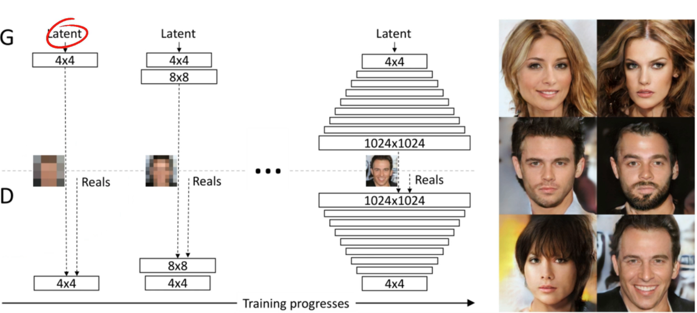
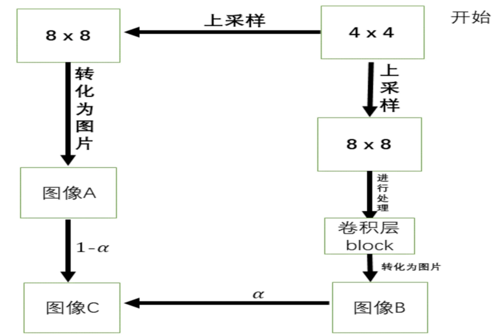
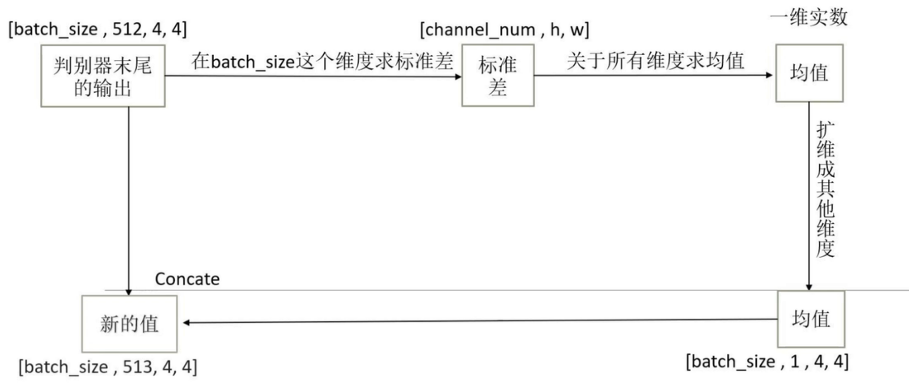

# Jamie Yi's Studying Notes
**总结：**
- 自己手写了一个朴素的`GAN`；
- 学习了`CGAN`、`PGGAN`、`StyleGAN`、`FastGAN`、`ProjectedGAN`的特点和网络结构；
- 跑了`Projected GAN`论文中的一部分数据，实验效果符合论文呈现的数据；
- 初步实验，将`EMP-SSL`中的`ContrastiveLearningViewGenerator`加到`ProjectedGAN`的数据加载器的`transform`中，效果不理想。目前正在修改代码，尝试将其作为判别器结构的一部分。
## Projected GAN
复现效果：与论文一致。
| **Datasets**         | **kmg**        | **FID**        |
|-------------------|----------------|----------------|
| **Pokemon**       |  0.5M          | 37.03          |
| **Art Painting**  |  0.2M          | 39.38          |
| **Landscape**     |  0.6M          | 15.09          |
| **Church**        |  1.1M          | 3.29           |


## EMP-SSL
感觉有点奇怪，没有读的特别懂，目前的理解就是，加大batch+增强数据

## 数学概念
- 协方差：反映随机变量之间的依赖关系
- 极大似然估计：根据样本数据，估计出分布的参数
- 信息熵：描述信息源各可能发生的事件的不确定性
- KL散度：用于衡量两个概率分布之间的差异的指标：非负性、非对称性
## native GAN
```Python
import torch
from torchvision.datasets import MNIST
from torchvision import transforms
from torch.utils.data import DataLoader
from tqdm import tqdm
import matplotlib.pyplot as plt

class Generate_Model(torch.nn.Module):
    '''
    生成器

    Sigmoid: 输出范围为(0, 1)。常用于二分类问题的输出层，因为它可以提供一个表示概率的结果。不过，在隐藏层中使用较少，主要是因为梯度消失问题。
    Tanh: 输出范围为(-1, 1)。类似地，虽然Tanh解决了Sigmoid输出非零中心的问题，但它同样面临梯度消失的问题。这里用Tanh可以很好符合像素值值域。
    ReLU: 输出范围为[0, +∞)。 ReLU解决了梯度消失问题，因为它对于正输入的梯度始终为1。然而，ReLU也有自己的局限性，如可能导致某些神经元“死亡”，因为负输入对应的梯度为0，无法更新权重。

    super() 是一个内置函数，用于调用父类（或基类）的方法。它通常用于子类中覆盖了父类方法时，想要保留父类方法的部分行为。
    self 是实例方法的第一个参数，代表当前实例。通过使用 self，可以在类的方法内部访问该实例的属性和其他方法。
    __init__ 是一个特殊的方法，被称为构造器或初始化方法。当创建一个新的类实例时，__init__ 方法自动被调用，用于执行任何必要的初始化步骤。
    fc 指的是“fully connected layer”（全连接层）
    forward 方法: 在此方法中定义了输入数据经过网络各层的顺序和方式。注意不要直接调用 forward 方法，应该通过实例化对象来进行调用，这样可以确保所有必要的钩子（比如自动微分机制）都被正确设置。
    '''
    def __init__(self):
        super().__init__()
        self.fc=torch.nn.Sequential(
            torch.nn.Linear(in_features=128,out_features=256),
            torch.nn.Tanh(),
            torch.nn.Linear(in_features=256,out_features=512),
            torch.nn.ReLU(), 
            torch.nn.Linear(in_features=512,out_features=784),
            torch.nn.Tanh() 
        )
    def forward(self,x):
        x=self.fc(x)
        return x

class Distinguish_Model(torch.nn.Module):
    '''
    判别器
    '''
    def __init__(self):
        super().__init__()
        self.fc=torch.nn.Sequential(
            torch.nn.Linear(in_features=784,out_features=512),
            torch.nn.Tanh(),
            torch.nn.Linear(in_features=512,out_features=256),
            torch.nn.Tanh(),
            torch.nn.Linear(in_features=256,out_features=128),
            torch.nn.Tanh(),
            torch.nn.Linear(in_features=128,out_features=1),
            torch.nn.Sigmoid()
        )
    def forward(self,x):
        x=self.fc(x)
        return x
    
def train():
    '''
    优化器的主要功能
    - 参数更新：优化器基于计算出的梯度来更新模型的权重和其他参数。不同的优化器使用不同的算法来决定如何应用这些梯度进行更新。
    - 学习率管理：
        - 学习率决定了每次更新步骤的大小。如果学习率过大，可能会导致训练过程不稳定，错过最优解；如果过小，则会使训练过程变得非常缓慢。
        - 许多优化器允许设置初始学习率，并且有些优化器能够自适应地调整学习率。例如，Adam优化器会为每个参数计算自适应学习率，而SGD（随机梯度下降）通常需要手动调整固定的学习率或通过学习率调度器动态调整。
    - 动量（Momentum）：一些优化器（如SGD with Momentum、RMSprop、Adam等）引入了动量的概念，它可以帮助加速优化过程并减少震荡，特别是在处理鞍点或局部极小值时。
    - 自适应学习率：某些高级优化器（如Adagrad、Adadelta、Adam等）能够自动调整每个参数的学习率，这有助于更有效地处理稀疏梯度和非平稳目标。
    
    BCELoss，即二元交叉熵损失（Binary Cross-Entropy Loss），是深度学习中用于解决二分类问题的一种损失函数。它衡量的是模型预测的概率分布与实际标签之间的差异。
    
    tqdm 是一个快速、可扩展的进度条库，广泛用于Python中来显示循环或长时间运行任务的进度。它的名字来源于阿拉伯语 "taqadum"，意思是“进步”或“发展”，并且它是一个非常直观和易于使用的工具，可以显著提高脚本或程序的用户体验。
    
    在定义 Distinguish_Model 类时实现了 forward 方法，使得这个类的实例可以直接像函数一样被调用。当你调用 D() 时，实际上是触发了该对象的 forward 方法。
    
    detach() 方法用于从计算图中分离出一个张量，这意味着该张量不再参与梯度计算。这对于防止不必要的梯度回传特别有用，特别是在生成对抗网络（GANs）中，当我们只需要更新判别器而不需要更新生成器时。
    
    在PyTorch中，计算图是动态构建的，这意味着每次你运行一段代码时都会重新构建计算图。
    当你创建一个模型并对其进行前向传播时，所有涉及的操作及其输入输出（包括模型的权重和偏置）都会被纳入到计算图中。

    D_optim.zero_grad()：清空之前计算的所有梯度。如果不执行这一步，在每次反向传播时，梯度会被累加而不是替换。这对于大多数情况来说不是期望的行为，因为我们通常希望基于当前批次的数据独立地更新权重。
    Dis_loss.backward()：执行反向传播。这一行会根据当前的损失值 Dis_loss 计算所有需要更新的参数的梯度。这些梯度会被存储在每个参数的 .grad 属性中。
    D_optim.step()：根据计算出来的梯度来更新模型的参数。具体如何更新取决于你使用的优化算法（在这个例子中是Adam优化器）。一般来说，这一步会按照一定的规则（如学习率等超参数设定）调整权重以最小化损失函数。
    '''
    device=torch.device("cuda:0" if torch.cuda.is_available() else "cpu") #判断是否存在可用GPU
    transformer = transforms.Compose([ # Compose组合，自定义一系列操作（如调整大小、裁剪、归一化等），然后以流水线的方式应用到图像数据集上。
        transforms.ToTensor(),
        transforms.Normalize(mean=0.5, std=0.5)
    ]) #图片标准化
    train_data = MNIST("./data", transform=transformer,download=True) #载入图片
    dataloader = DataLoader(train_data, batch_size=64,num_workers=4, shuffle=True) #将图片放入数据加载器

    D = Distinguish_Model().to(device) #实例化判别器
    G = Generate_Model().to(device) #实例化生成器

    D_optim = torch.optim.Adam(D.parameters(), lr=1e-4) #为判别器设置优化器
    G_optim = torch.optim.Adam(G.parameters(), lr=1e-4) #为生成器设置优化器

    loss_fn = torch.nn.BCELoss() #损失函数

    epochs = 100 #迭代100次
    for epoch in range(epochs):
        dis_loss_all=0 #记录判别器损失损失
        gen_loss_all=0 #记录生成器损失
        loader_len=len(dataloader) #数据加载器长度
        for step,data in tqdm(enumerate(dataloader), desc="第{}轮".format(epoch),total=loader_len):
            
            # 先计算判别器损失
            sample,label=data #获取样本，舍弃标签
            sample = sample.reshape(-1, 784).to(device) #重塑图片 28*28=784
            sample_shape = sample.shape[0] #获取批次数量

            #从正态分布中抽样
            sample_z = torch.normal(0, 1, size=(sample_shape, 128),device=device)

            Dis_true = D(sample) #判别器判别真样本

            true_loss = loss_fn(Dis_true, torch.ones_like(Dis_true)) #计算损失

            
            fake_sample = G(sample_z) #生成器通过正态分布抽样生成数据

            '''
            .detach()：创建一个新的张量，该张量与原始张量共享相同的数据存储，但不包含任何梯度信息或连接到原始张量所在的计算图。这意味着，在后续的计算中，即使你对新的张量进行操作并执行反向传播，梯度也不会流回到 fake_sample 的生成路径上。
            通过 fake_sample.detach() 直接作用于传递给 D 的参数，确保了 fake_sample 不再包含任何梯度信息，从而防止了梯度回传到生成器 G。
            '''
            Dis_fake = D(fake_sample.detach()) #判别器判别伪样本
            fake_loss = loss_fn(Dis_fake, torch.zeros_like(Dis_fake)) #计算损失

            Dis_loss = true_loss + fake_loss #真假加起来
            D_optim.zero_grad()
            '''
            G_loss 不仅仅是一个标量（即损失值），它实际上还关联着一个计算图。
            这个计算图记录了从输入数据到 G_loss 的所有操作，包括通过生成器 G 和判别器 D 的前向传播过程中涉及的所有中间变量和操作。
            '''
            Dis_loss.backward() #反向传播
            D_optim.step()

            # 生成器损失
            Dis_G = D(fake_sample) #判别器判别 Dis_G:判别器对生成样本的输出结果
            G_loss = loss_fn(Dis_G, torch.ones_like(Dis_G)) # 计算损失 # 注意这里和公式有点不一样，但其实是等价的   
            G_optim.zero_grad()
            G_loss.backward() # 反向传播  
            G_optim.step() # 使得loss小

            '''
            尽管梯度计算的确是在 .backward() 调用时进行的，但在以下几种情况下，使用 torch.no_grad() 仍然是有益的：

            - 避免不必要的计算图构建：即使你不打算对某些张量调用 .backward()，PyTorch 默认也会为这些张量的操作构建计算图。如果你正在进行的操作不需要梯度（例如，验证阶段、损失累加等），使用 torch.no_grad() 可以告诉 PyTorch 不要为这些操作保留计算图，从而节省内存和加速计算。
            - 提高推理速度：在模型推理（如测试或部署）阶段，我们通常不需要计算梯度。使用 torch.no_grad() 可以禁用梯度计算，使得前向传播更快，因为没有计算图的构建和存储开销。
            - 减少内存占用：对于大规模数据集或复杂模型，构建完整的计算图可能会消耗大量内存。通过在适当的地方使用 torch.no_grad()，可以显著减少内存使用。
            '''
            with torch.no_grad():
                dis_loss_all+=Dis_loss #判别器累加损失
                gen_loss_all+=G_loss #生成器累加损失

        with torch.no_grad():
            dis_loss_all=dis_loss_all/loader_len
            gen_loss_all=gen_loss_all/loader_len
            print("判别器损失为：{}".format(dis_loss_all))
            print("生成器损失为：{}".format(gen_loss_all))
        torch.save(G, "./G.pth") #保存模型
        torch.save(D, "./D.pth") #保存模型


if __name__ == '__main__':
    # train() #训练模型
    model_G=torch.load("./G.pth",map_location=torch.device("cpu"), weights_only=False) #载入模型
    fake_z=torch.normal(0,1,size=(10,128))  #抽样数据
    result=model_G(fake_z).reshape(-1,28,28)  #生成数据
    result=result.detach().numpy()

    # #绘制
    # for i in range(10):
    #     plt.subplot(2,5,i+1)
    #     plt.imshow(result[i])
    #     plt.gray()
    # plt.show()

    # 创建一个新的图形
    plt.figure(figsize=(10, 4))

    # 绘制每个子图
    for i in range(10):
        plt.subplot(2, 5, i + 1)
        plt.imshow(result[i], cmap='gray')  # 确保使用灰度色彩映射
        plt.axis('off')  # 关闭坐标轴

    # 调整子图之间的间距
    plt.subplots_adjust(wspace=0.1, hspace=0.1)

    # 保存图像到文件
    plt.savefig('output.png', bbox_inches='tight', pad_inches=0.1)

    # 如果你还想显示图像，可以取消下面这行的注释
    # plt.show()

    # 清除当前的图形，释放内存
    plt.close()
```
## CGAN: Conditional GAN
按照给定标签生成图像，要训练的时候就把标签也送进去。
标签用独热编码。
如果对文字的编码足够强大，比如像GPT和stable diffsion那样，能够使用足够好的向量对文字进行表征，那就有比较好的生成效果了。
## PGGAN: Progressive Growing of GANs for Improved Quality, Stability, and Variation
### 传统GAN所存在的问题
- 模式崩溃（model collapse）：生成数据只是原始数据的子集
- GAN很难训练高分辨率的图片：在训练高分辨率的图片是生成器很容易直接崩掉。初始的时候所有的参数都是随机生成的，反向传播的时候判别网络会反馈给生成网络极大的梯度，参数进行大范围的更新。
### 特征图（Feature Map）
[channel_num, h, w]
### PGGAN的改进点
1. 渐进式训练（Progressive Growing）
- 先训练低分辨率的图像，再从低分辨率逐渐提高到高分辨率：

Latent代表从标准正态分布中采样出来的向量    
- 平滑过度，α的值越来越大：


- 2x上采样：最近邻采样，0.5x下采样：平均池化
- fromRGB：channel_num: 3->某个值
- 训练时间下降到2~6倍
2. 均衡学习率
在模型训练的时候对参数w进行约束。再前向传播的时候对参数w（如卷积核的值）的值进行缩放。
能够有效平衡所有参数w的学习，因为每个参数需要更新的次数不同。
3. 像素特征向量的归一化
对每一个卷积层的输出层，都进行一个像素特征向量的归一化。
在channel这个维度上进行归一化。
能够有效防止后面计算的时候数值溢出、防止数值爆炸，有助于模型训练的稳定，并且能够保证输出值的尺度一致性（控制在一个值内）。
4. 使用小批量标准差增加生成样本多样性
在判别器末尾加一个统计层，有效防止模式崩溃

5. 对判别器的损失加上一个极小的权重项（只有在训练CELEBA-HQ时而提出的做法，用于防止判别网络非常好的时候，导致判别网络停止更新的情况）

## Style GAN
特征值之间存在极大耦合，我们需要对特征解耦


